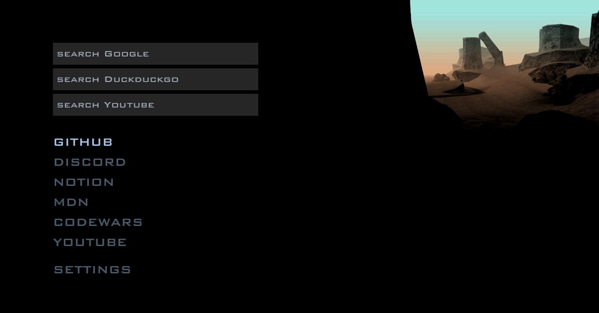

# GTA-SA Menu Startpage

A browser start page that looks like the iconic GTA San Andreas menu

> [!Note]
> The live site is hosted [here](https://wjkba.github.io/gta-sa-menu-startpage/)

 

To configure it as your new tab page, use these extensions:

- Firefox: [Custom New Tab Page](https://addons.mozilla.org/en-US/firefox/addon/custom-new-tab-page/?src=search)
- Chromium browsers: [Custom New Tab URL](https://chrome.google.com/webstore/detail/custom-new-tab-url/mmjbdbjnoablegbkcklggeknkfcjkjia)

You can also build the page yourself and run it locally. Feel free to customize the design and functionality to your liking.

 

## Features
- Classic menu sound effects
- Multiple background options to choose from
- Move up and down in menu using jk, ws, or the arrow keys
- Integrated search engines

 

## Acknowledgments
All credit for the original design goes to Rockstar.
